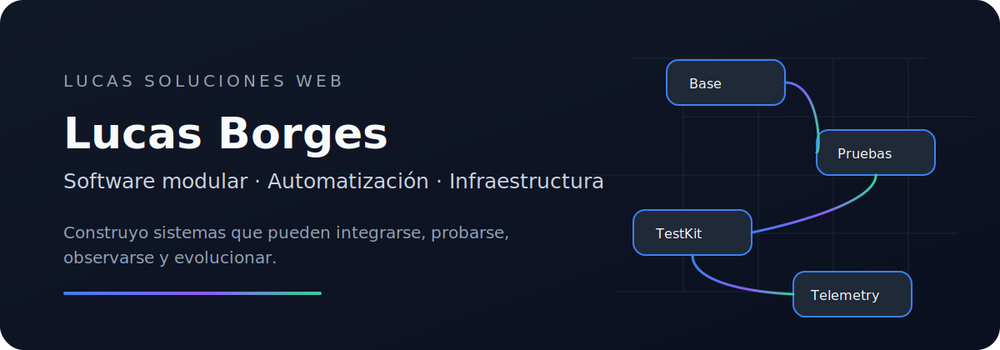
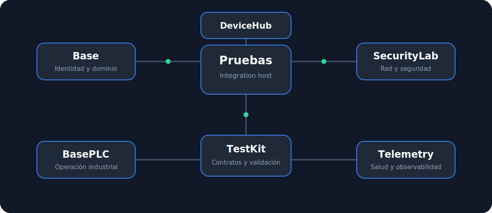
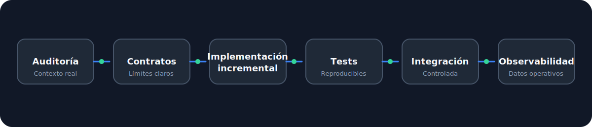

<p align="center">
  
</p>

<p align="center">
  <a href="https://www.instagram.com/lucas.solucionesweb/">
    
  </a>
  <a href="https://github.com/lucasborges2001">
    
  </a>
</p>

## Sistemas que pueden evolucionar

Diseño y evoluciono **sistemas web modulares**, infraestructura reproducible y herramientas de validación para proyectos técnicos complejos.

Mi enfoque conecta arquitectura, automatización, pruebas y operación:

```text
repositorios → contratos → tests → contenedores → integración → telemetría
```

Trabajo principalmente con **PHP**, **Laravel**, **Docker**, **GitHub Actions**, **Bash**, bases de datos, agentes de IA, dispositivos y sistemas industriales.

---

## Ecosistema técnico

<p align="center">
  
</p>

`Pruebas` funciona como host de integración. Los módulos mantienen responsabilidades separadas y contratos explícitos para poder evolucionar sin convertir el sistema en un monolito acoplado.

| Proyecto | Responsabilidad |
|---|---|
| [Pruebas](https://github.com/lucasborges2001/Pruebas) | Integración, perfiles, Docker y validación transversal |
| [Base](https://github.com/lucasborges2001/Base) | Identidad, organizaciones, sedes y componentes reutilizables |
| [testKit](https://github.com/lucasborges2001/testKit) | Pruebas reproducibles y reportes compactos para agentes |
| [BasePLC](https://github.com/lucasborges2001/BasePLC) | Operación controlada, auditoría y estado de PLC |
| [securityLab](https://github.com/lucasborges2001/securityLab) | Seguridad, red, dispositivos y experimentación técnica |
| [DeviceHub](https://github.com/lucasborges2001/DeviceHub) | Abstracción e integración de dispositivos |

---

## Cómo construyo software

<p align="center">
  
</p>

| Principio | Aplicación |
|---|---|
| **Contract-first** | Los límites y compatibilidades se definen antes de expandir una integración |
| **Expand-only** | La estructura nueva evita cambios destructivos innecesarios |
| **Reproducible validation** | Cada cambio debe poder verificarse con comandos, tests y logs |
| **Observable systems** | La operación necesita salud, consumo, tráfico, eventos y trazabilidad |
| **Incremental delivery** | El trabajo se divide en fases pequeñas, auditables y reversibles |

---

## Áreas de trabajo

```yaml
architecture:
  - modular systems
  - reusable components
  - submodules and integration contracts

automation:
  - GitHub Actions
  - Bash and Docker
  - AI-assisted engineering workflows

operation:
  - server telemetry
  - network and API traffic
  - PLC and device management
  - security validation
```

---

## Lucas Soluciones Web

En **[@lucas.solucionesweb](https://www.instagram.com/lucas.solucionesweb/)** comparto contenido y soluciones sobre:

- desarrollo web;
- programación y arquitectura;
- automatización de procesos;
- infraestructura y operación;
- construcción de productos digitales mantenibles.

La idea es simple: **menos improvisación, más sistema**.

<p align="center">
  <a href="https://www.instagram.com/lucas.solucionesweb/">
    
  </a>
</p>

---

## Actividad técnica

<p align="center">
  
  
</p>

<p align="center">
  <sub>Las métricas describen actividad pública. La arquitectura, los contratos y la mantenibilidad son el foco real.</sub>
</p>

---

<p align="center">
  <strong>Software modular. Infraestructura observable. Automatización verificable.</strong>
</p>

<p align="center">
  <a href="https://github.com/lucasborges2001?tab=repositories">Explorar repositorios</a>
  ·
  <a href="https://www.instagram.com/lucas.solucionesweb/">Ver contenido</a>
</p>
